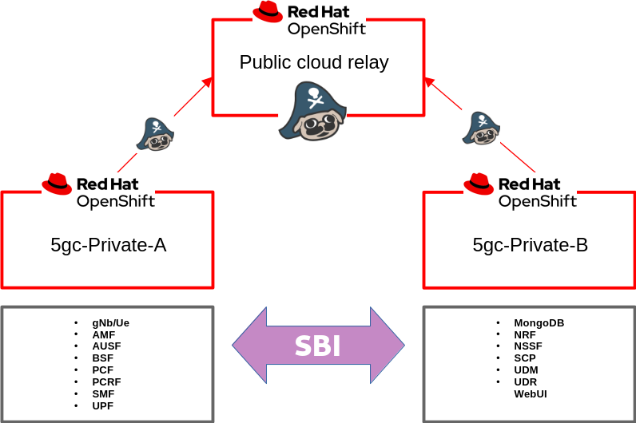
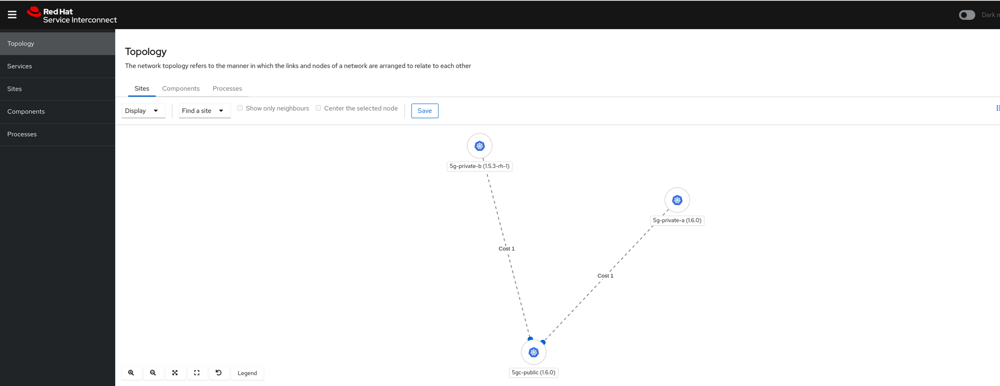
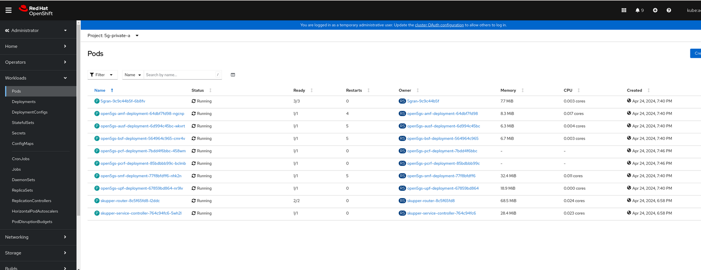
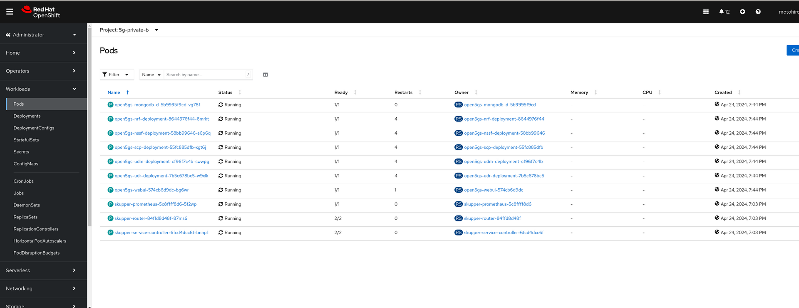
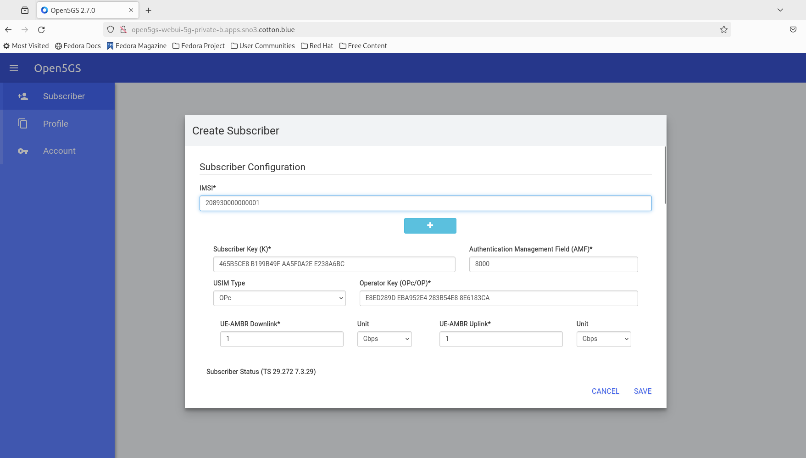
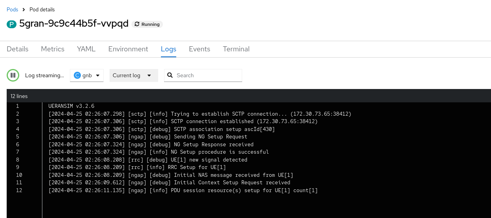
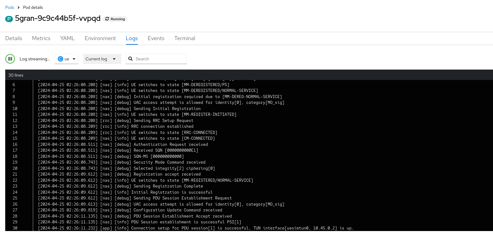
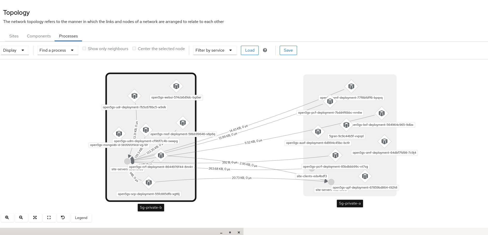

# Introduction
[Red Hat Service Interconnect](https://www.redhat.com/en/technologies/cloud-computing/service-interconnect) has recently announced the general availability of Red Hat Service Interconnect 1.5. Built upon the upstream [Skupper.io project](https://skupper.io/index.html), it enables secure communication across Kubernetes clusters with no VPNs or special firewall rules.

[Open5GS](https://open5gs.org/) is an open-source project enabling the construction and testing of 5G Core elements. Notably, Open5GC now aligns with 3GPP Release-17 standards.

In this blog post, I will demonstrate the deployment of Open5GC elements across two OpenShift private clusters. Subsequently, I will utilize a public cluster as a relay cluster via Skupper. This setup will emulate a scenario where two vendors can efficiently conduct interoperability testing without the need for VPNs or complex setups involving multiple organizations and network elements.

Specifically, this blog will explore how Open5GS, including SCP (Service Capability Exposure Function), facilitates indirect communication within a Service-Based Architecture (SBA). NF (Network Function) discovery will occur through SCP, operating seamlessly across the two private clusters.

# Before We Get Started

Before delving into the deployment process, I'd like to express my gratitude to the various blogs and GitHub repositories that have contributed immensely to my learning journey. Leveraging the insights gleaned from these resources, I successfully built the Open5GS container (version 2.7.0) and crafted the deployment manifest.As a result, you may encounter similarities between my code and those found in these sources. Their contributions have been invaluable, and I'm truly grateful for their shared knowledge and expertise. if i am violoating anyting, pelase let me know.

* [Kubernetes Open5GS Deployment](https://dev.to/infinitydon/virtual-4g-simulation-using-kubernetes-and-gns3-3b7k?fbclid=IwAR1p99h13a-mCfejanbBQe0H0-jp5grXkn5mWf1WrTHf47UtegB2-UHGGZQ)
* [Open5Gs and UERANSIM](https://nickvsnetworking.com/my-first-5g-core-open5gs-and-ueransim/)
* [Open Source 5G on OpenShift Container Platform with Service Mesh](https://medium.com/@anil.sonmez/open5gs-on-openshift-container-platform-c92e72dd4738)

# Architecture
so this is the hight level architecrue. I will have three clusters. One for public cluster that each private cluster can reach to and use it as relay router. and two for private cluster behind firewall.

UERANSIM, the UE/gNodB simulator, operates within the on-premises cluster "5gc-private-A," alongside components such as AMF, SMF, AUSF, and UPF. Subscriber data provisioning occurs on the UDM, which runs within the on-premises cluster "5gc-private-B." These clusters are interconnected via a relay site hosted in the public cloud.




# Prerequisit
here are some prequisits:

* STP module is loaded on Private cluster A or where UERANSIM and AMF are located.
* 3 clusters are up and runnign and you hvae cluster-admin role.
* Service Interconnect operator has been installed. if not, please follow the production documenation.
* Skupper CLI is availabe. Install the skupper command-line tool.

````
curl https://skupper.io/install.sh | sh
````

# Architecture diagram

# Skupper Setup
To begin, open three terminals, one for each cluster. Ensure that you are operating within the correct cluster context. If you are using a single kubeconfig, remember to switch the context accordingly.

First, let's set up a namespace and instantiate the Skupper router within it. Then, we'll create links between the clusters.

Also, we will install the service interconnect web console in the private-A cluster.

## Public Cluster
On the public cluster, we will create a token for the Relay.

Create a Namespace.
Install the Skupper router.
Generate tokens for the Relay.


```Console on public cluster
On the public cluster, we will create a token for the Relay.

Create a Namespace.
Install the Skupper router.
Generate tokens for the Relay.

```

## Private A cluster

1. Create Namespace
2. Install Skupper router with ConfigMap
3. Create link to Public Cluster

````
$ oc new-project 5g-public-a

$ skupper init

$ skupper link create ~/relay-private-a.yaml

````

after creating the link, the Public cluster can see the link.
````
$ skupper link status

Links created from this site:

	 There are no links configured or connected

Current links from other sites that are connected:

	 Incoming link from site eda4bdf3-97cd-4a1d-807e-6bbae8740878 on namespace 5g-private-a


````

## Private B cluster

1. Create Namespace
2. Install Skupper router with ConfigMap
3. Create link to Public Cluster

```
$ oc new-project 5g-public-a

$ cat <<EOF | oc apply -f -
apiVersion: v1
kind: ConfigMap
metadata:
  name: skupper-site
data:
  console: "true"
  flow-collector: "true"
  console-user: "admin"
  console-password: "changeme"
EOF

$ skupper link create ~/relay-private-b.yaml
```

Skupper GUI should be avialable.

````Public A console
$ skupper link status

Links created from this site:

	 There are no links configured or connected

Current links from other sites that are connected:

	 Incoming link from site eda4bdf3-97cd-4a1d-807e-6bbae8740878 on namespace 5g-private-a
	 Incoming link from site 89673f0d-9b7e-482e-8a20-87963ad9aabd on namespace 5g-private-b

````




# 5GC installation

please colone the git repository.

````
git clone https://github.com/mabehiro/open5gs-skupper.git
````


Make sure you are in the right kubeconfig context.

## Private cluster A

For simplicity and lab purposes, add policies to the default ServiceAccount of the namespace:
````
$ cd open5gs-skupper/5gc-private-A
# oc project 5g-private-a
$ oc adm policy add-scc-to-user anyuid -z default
$ oc adm policy add-scc-to-user hostaccess -z default
$ oc adm policy add-scc-to-user hostmount-anyuid -z default
$ oc adm policy add-scc-to-user privileged -z default

````
using helm, install 5GC workloads.
````
helm install -f values.yaml 5g-private-a ./
````

then we will expose services to other clusters with skupper. In the manifest, there are configmaps for each NF, and there are references to the services eposed by skupper.
````
skupper expose service/open5gs-amf --address open5gs-amf-skupper
skupper expose service/open5gs-ausf --address open5gs-ausf-skupper
skupper expose service/open5gs-bsf --address open5gs-bsf-skupper
skupper expose service/open5gs-pcf --address open5gs-pcf-skupper
skupper expose service/open5gs-smf --address open5gs-smf-skupper
````

## Public cluster B

````
$ cd open5gs-skupper/5gc-private-B
# oc project 5g-private-b
oc adm policy add-scc-to-user anyuid -z default
oc adm policy add-scc-to-user hostaccess -z default
oc adm policy add-scc-to-user hostmount-anyuid -z default
oc adm policy add-scc-to-user privileged -z default

````

````
helm install -f values.yaml 5g-private-b ./
````

````
skupper expose service/mongodb-svc --address mongodb-svc-skupper
skupper expose service/open5gs-nrf --address open5gs-nrf-skupper
skupper expose service/open5gs-nssf --address open5gs-nssf-skupper
skupper expose service/open5gs-scp --address open5gs-scp-skupper
skupper expose service/open5gs-udm --address open5gs-udm-skupper
skupper expose service/open5gs-udr --address open5gs-udr-skupper
````

Give some time to these pods on each cluster to settle. you might see some carsh but you can just restart those pods.

Eventually, we should observe the running status on each cluster.







### Provisioin a subscriber
Now it is time to provision a subscriber.
Expose open5gs-webui services and then we can provision a subscriber.

#### Private B
````
$ oc expose svc/open5gs-webui

````
there is a glitch on my webuid buid. there is workaround. refer to this article.
Username and Password is admin/1423.


Then provision a subscriber (208930000000001)



Restart 5gran pods, and monitor the logs.

## Check UE logs
We mihgt need to restart the UERANSIM pod, but once the pod finds the AMF, we should be able to see PDU session message along with TUN interface information in the log.





## Service Interconnect

Okay, so what can we see from the Service Interconnect console? The Service Interconnect GUI should be able to display the network topology view. 5GC NFs are interconnected each other even they are in differenent prviate cluster thanks to public relay cluster.




